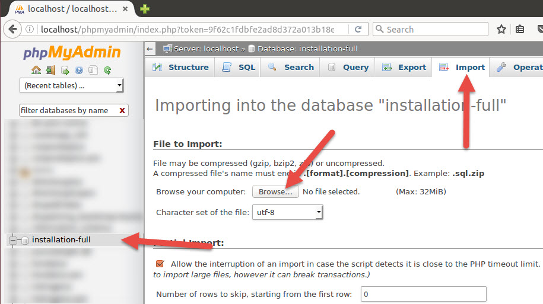

# Installation

Webmaker+ installation guidelines for Drupal 9. 

:::tip

At the end of the installation process documented below you will be able to login to your Drupal site as administrator. 

To login, once you install, go to `/user/login` url and use the following credentials:
* u: `admin`
* p: `password`

:::

## 1. Installation on a LAMP stack or a typical hosting environment.
To complete and installation please follow the steps below:

1. Place the included `full_installation/` folder under your Apache server path[^1].
2. Create an empty MySQL database and **take note of the database name**.
3. In your newly created database, import the `database/db_instance.sql` file. The following screen shows the steps to do this through phpMyAdmin. If your hosting environment does not come with a similar tool installed please ask your hosting provider for assistance on how to import the database file.



4. Start the Drupal installation wizard by pointing your browser to the recently created folder, in your Apache server path.


5. Continue the installation by selecting the "Standard" installation profile.


If confronted with any **warnings**, click to continue with installation.


6. Enter your recently created database information. This includes the database name and credentials (username/password) you have chosen when creating it, spelled exactly as in step 3 above.


7. The installation wizard will recognize that you are using an already populated database and will inform you accordingly. At the same time, the wizard should create all the necessary files your Drupal site needs in order to work properly on your server.


8. You are done. Click on the "visit existing site" link, to visit your new site.


## 2. Installation with DDEV
> [DDEV](https://ddev.readthedocs.io/) is an open source tool that makes it dead simple to get local PHP development environments up and running within minutes. It's powerful and flexible as a result of its per-project environment configurations, which can be extended, version controlled, and shared. In short, DDEV aims to allow development teams to use Docker in their workflow without the complexities of bespoke configuration.

We strongly recommend using DDEV in your local environment for development. 

Before you start, please ensure that [DDEV](https://ddev.readthedocs.io/en/latest/users/install/) is properly installed in your system. 

Installation steps:
* Navigate into the `full_installation/` folder
* Initialize DDEV: `ddev config`
* Select a project name and the platform as follow:

```bash
Project name (full_installation): Webmaker
Docroot Location (current directory):
Project Type [backdrop, drupal6, drupal7, drupal8, drupal9, laravel, magento, magento2, php, shopware6, typo3, wordpress] (drupal9):
```
* Start the environment: `ddev start`
* Import the database: `ddev import-db`
* In the following prompt, provide a relative path to the `db_instance.sql` file. e.g. `../database/db_instance.sql`
* Open a browser: `ddev launch` 

### Install Drush and Login without credentials
* Require `drush`: `ddev composer require drush/drush`
* Get an one time login URL: `ddev drush uli` 


--------------------------------------------
------- Remove anything after this line
--------------------------------------------

### 2.4.2 Install for Commerce Development - Recommended (dev installation)

This is a Composer based development workflow.

#### Before you start

Make sure that you read the article “[Using Composer to manage Drupal site dependencies](https://www.drupal.org/node/2718229)” at Drupal.org, in order to understand the requirements and procedures of managing a site with Composer:<br></br>

https://www.drupal.org/node/2718229

Prepare your environment

1. Make sure that our server is running PHP 7.4 or PHP 8.0. For more information visit:<br></br> 
https://www.drupal.org/docs/system-requirements/php-requirements
2. Install Composer on your machine. For more information, visit:<br></br> 
https://getcomposer.org/doc/00-intro.md

#### Installation steps


1. Place the included “**d9/dev_installation/site**” folder under your Apache server path[^1].
2. Create an empty MySQL database and take note of the database name.
3. In your newly created database, import the “**d9/dev_installation/database/db_instance_pro.sql**” file that comes with the theme. For additional information, please ask your hosting provider for assistance on how to import the database file.
4. Require the dependencies. All dependencies, the Drupal core and the contributed modules are managed by Composer

    - Download Drupal Core and Modules:
            Change directory to web root and execute the following command:<br></br>
            ``composer install``

5. Start the Drupal installation wizard by pointing your browser to the recently created folder, in your Apache server path.

[^1]: How to find your Apache server path: if you are deploying online, your hosting provider should be able to provide you this. If you are deploying locally, it will be where your XAMPP or MAMP installation is configured to look into (e.g.: htdocs, in the case of MAMP on Mac OS X).
