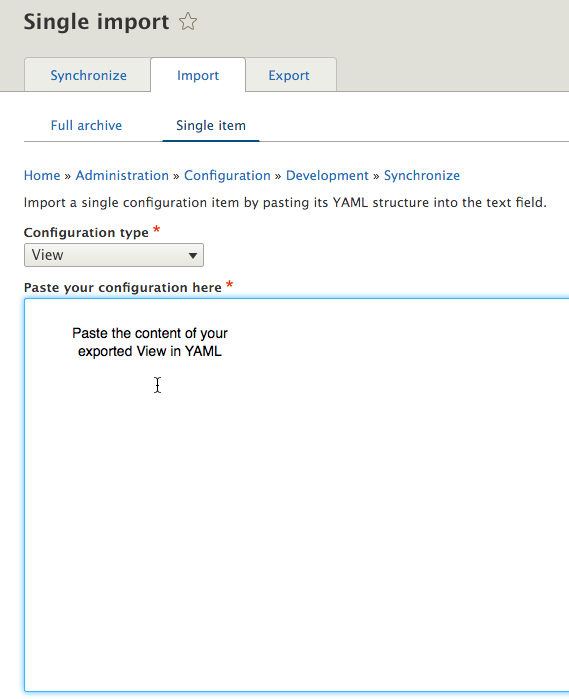

# 2. Installation

Theme installation guidelines for Drupal 9. 
There are two main ways to use Base+ Business: (1) install as a full-featured Drupal distribution, and (2) apply as a simple Drupal theme, on top of an existing Drupal 8 core installation.

## 2.1. Install as a full Drupal distribution (with all features as seen in demo)

> At the end of the installation process documented below you will be able to log
    in to your Drupal site as administrator. To login, once you install, go to       
    /user/login url      
    and use the following credentials:   
    u: **admin**,  
    p: **password**

To install Base+ Business for Drupal 9, with the demo content and the full functionality, including Content types, Slider(s), Views pages and blocks, and special layouts, please follow the steps below.

1. Place the included **“d9/full_installation/site”** folder under your Apache server path[^1].
2. Create an empty MySQL database and **take note of the database name**.
3. In your newly created database, import the **“d9/full_installation/database/db_instance.sql”** or the **“d9/full_installation/database/db_instance_pro.sql”** file (for the pro installation) that comes with the theme. The following screen shows the steps to do this through phpMyAdmin. If your hosting environment does not come with a similar tool installed please ask your hosting provider for assistance on how to import the database file.

4. Start the Drupal installation wizard by pointing your browser to the recently created folder, in your Apache server path.

5. Continue the installation by selecting the "Standard" installation profile.

If confronted with any **warnings**, click to continue with installation.

6. Enter your recently created database information. This includes the database name and credentials (username/password) you have chosen when creating it, spelled exactly as in step 3 above.

7. The installation wizard will recognize that you are using an already populated database and will inform you accordingly. At the same time, the wizard should create all the necessary files your Drupal site needs in order to work properly on your server.

8. You are done. Click on the "visit existing site" link, to visit your new site.

9. Once you are done with the above, please login to this site through the /user/login url and by using the following credentials:
- username: **admin**
- password: **password**

10. Navigate to **/admin/reports/status** and make sure that there are no errors regarding the “File system” item. In case of errors please make sure to resolve those and then clear the Drupal Cache.

&nbsp;&nbsp;&nbsp;&nbsp;&nbsp;&nbsp;&nbsp;Other errors may exist and should also be taken care of.

11. Navigate to **/user/1/edit** and change the email of the admin user to the one you are using.
12. Navigate to **/admin/structure/contact** and change the recipients email of the contact forms so that you receive the messages in your inbox.
13. By default, our theme distribution comes with Drupal 8 caching ***deactivated***, ensuring a smoother experience during any technical work you will need to do post-installation.

Either right after installation, or when you finish building your Drupal 8 site using this theme, it is recommended to activate Drupal caching and aggregation of CSS and JS files, for better performance.

To do so, navigate to **/admin/config/development/performance** and enable caching (default option: 15 min) as well as the “Aggregate CSS files” and “Aggregate JavaScript files” options.

## 2.2. Install as a simple theme over existing Drupal site

1. Open the **simple_theme_installation/theme** folder, that came in the pack.
2. If working on a local environment, copy the **“baseplus”** folder. If working directly on your web environment, select the **“baseplus”** folder in order to upload it in the next step.
3. Paste or upload the **“baseplus”** folder into the corresponding path **themes » custom**, in your existing Drupal 8 installation. If you don’t have a “custom” folder under themes, it’s strongly recommended to create one.
4. Log in to your existing Drupal 8 installation as admin, with your credentials.
5. Browse to the **"Appearance"** section of the Drupal admin environment.
6. Find the theme and activate it by clicking “install”.
7. Click “Set as default” to make it your default theme.
8. Browse to the homepage, then hit "refresh" in your browser. You should now see your site styled using Base+.

## 2.3. Install over existing Drupal installation, with the special features

Important notice: It is strongly recommended that you execute the instructions below on **a cloned instance of your production site.** This is the safest way to handle this, ensuring that your production site remains unaffected if you make any mistakes in any of the steps below.

1. Start by creating a **full installation** of your purchased theme product, with its content types, Views blocks and pages and special features, as advised in section 2.1. This will be used for reference and exporting features only and can therefore be installed on your test dev environment.
2. Copy the simple Drupal theme from your full product installation above or from the product folder you downloaded, into the clone of your existing Drupal installation, then activate the theme, as described in section **2.2**. Your existing Drupal installation should be now re-styled according to the looks of your purchased product. However, the parts of the purchased theme product that you are still not seeing are:  
    &nbsp;&nbsp;&nbsp;&nbsp;a. Special Content Types  
    &nbsp;&nbsp;&nbsp;&nbsp;b. Special Views and Blocks  
    &nbsp;&nbsp;&nbsp;&nbsp;c. Special Menus  
    &nbsp;&nbsp;&nbsp;&nbsp;d. Other Special features

3. Install the theme required libraries. Just copy the  content of the **d9/simple_theme_installation/libraries** folder of the theme pack into the **libraries** folder of your installation. If your installation does not have a libraries folder please create it.
4. Install the theme required modules. Just copy the content of **d9/simple_theme_installation/modules** folder of the theme pack into the modules folder of your installation. Finally enable those modules through the Drupal administration interface.
5. Adjust Image styles through Home » Administration » Configuration » Media » Image Styles. Use the full installation of the product mentioned in step 1 for reference:  

 Home » Administration » Configuration » Media » Image Styles

6. Reproduce all custom Content Types by using the full installation as a reference to guide you. Make sure you are ***using the same machine names for the content type and the fields of the content type***.

 Use the full installation of the product mentioned in step 1 for reference.

 Finally make sure that you have also reproduced the display settings in the **“Manage form display”** and **“Manage display”** tabs as well as for the **teaser** and **default** display.

7. Export all the views from the **full installation** created on step 1 and import the views in your main installation.

Navigate to

Home » Administration » Configuration » Development » Synchronize » Import

and select the single item tab. Make sure you select the “View” configuration type, paste the content of each .yml file into the text area and save the configuration. You will have to do this for each file you exported.

8. Reproduce all custom block types by using the full installation as a reference to guide you. Navigate to Home » Administration » Structure » Block layout » Custom block library and select the **Types** tab.

 Make sure you are ***using the same machine names for the custom block type as well as the corresponding fields.*** This procedure is similar to step 6 above.

 Finally make sure that you have also reproduced the display settings in the **“Manage form display”** and **“Manage display”** tabs.
9. Configure your existing blocks to make use of the new regions the premium theme provides. You can use multiple instances of the various blocks, as well.

## 2.4 Install Drupal Commerce

The pack contains two installation options for the Flashy+ commerce distribution. The full installation under the **flashyplus_commerce/d9/full_installation** path and the dev installation under the **flashyplus_commerce/d9/dev_installation** path. The full_installation is provided for demonstration purposes only. Consider using the  dev_installation for development.

### 2.4.1 Install as a full Drupal Distribution (full installation)

This section explains how to perform the full installation for demonstration purposes only.
Commerce 2.x should only be installed via Composer. The files on this pack are provided for demonstration purposes only.  
https://www.drupal.org/project/commerce

This installation method does not require the Composer dependency manager. All dependencies are pre-installed and all you need to do is to import the database and start the  Drupal installation wizard as in section:
[2.1. Install as a full Drupal distribution (with all features as seen in demo)](#21-install-as-a-full-drupal-distribution-with-all-features-as-seen-in-demo) 

### 2.4.2 Install for Commerce Development - Recommended (dev installation)

This is a Composer based development workflow.

#### Before you start

Make sure that you read the article “[Using Composer to manage Drupal site dependencies](https://www.drupal.org/node/2718229)” at Drupal.org, in order to understand the requirements and procedures of managing a site with Composer:  

https://www.drupal.org/node/2718229

Prepare your environment

1. Make sure that our server is running PHP 7.4 or PHP 8.0. For more information visit:   
https://www.drupal.org/docs/system-requirements/php-requirements
2. Install Composer on your machine. For more information, visit:   
https://getcomposer.org/doc/00-intro.md

#### Installation steps

1. Place the included “**d9/dev_installation/site**” folder under your Apache server path[^1].
2. Create an empty MySQL database and take note of the database name.
3. In your newly created database, import the “**d9/dev_installation/database/db_instance_pro.sql**” file that comes with the theme. For additional information, please ask your hosting provider for assistance on how to import the database file.
4. Require the dependencies. All dependencies, the Drupal core and the contributed modules are managed by Composer

    - Download Drupal Core and Modules:
            Change directory to web root and execute the following command:  
            ``composer install``

5. Start the Drupal installation wizard by pointing your browser to the recently created folder, in your Apache server path.

[^1]: How to find your Apache server path: if you are deploying online, your hosting provider should be able to provide you this. If you are deploying locally, it will be where your XAMPP or MAMP installation is configured to look into (e.g.: htdocs, in the case of MAMP on Mac OS X).