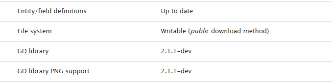
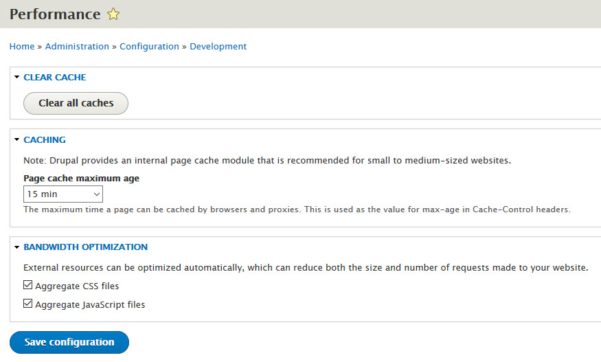

# Post Installation Tasks
Once you are done with the above, please login to this site through the `/user/login` url and by using the following credentials:
- username: `admin`
- password: `password`

## Check the Status Report
1. Navigate to `/admin/reports/status` and make sure that there are no errors regarding the “File system” item. In case of errors please make sure to resolve those and then clear the Drupal Cache.

Other errors may exist and should also be taken care of.

## Edit the admin user and set the password
1. Navigate to `/user/1/edit` and change the email of the admin user to the one you are using.
2. Navigate to `/admin/structure/contact` and change the recipients email of the contact forms so that you receive the messages in your inbox.

## Enable the cache (for production)
3. By default, our theme distribution comes with Drupal caching ***deactivated***, ensuring a smoother experience during any technical work you will need to do post-installation.

Either right after installation, or when you finish building your Drupal site using this theme, it is recommended to activate Drupal caching and aggregation of CSS and JS files, for better performance.

To do so, navigate to `/admin/config/development/performance` and enable caching (default option: 15 min) as well as the “Aggregate CSS files” and “Aggregate JavaScript files” options.

