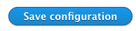

# Basic Theme Overview

## 1. Theme regions

Webmaker+ incorporates the **45 regions** shown below, to help you take advantage of the flexibility Drupal regions provide. 

## 2. Theme Settings

Webmaker+ comes with a great collection of theme settings, so that you can customize the looks, layout, interaction and functionality of your site through the Drupal admin user interface, without having to mess with the code (although that is always perfectly possible). 

The theme comes with 11 main groups of theme settings: 
- Basic Settings
- Bootstrap
- Look ’n’ Feel
- Region Settings
- Article Features
- Theme Layout
- Font Settings
- Slideshow Settings
- In page navigation
- Isotope Filters
- 3rd party integrations

All theme settings are available under the Appearance section, in the Drupal admin environment: 

Home »  Administration »  Appearance »  Appearance settings

**Important notice:** 
With all theme settings, remember to hit “Save configuration” when you change something, to see your edits reflected on the site running Webmaker+.

### 2.1. Basic Settings

A selection of theme settings affecting the site globally. 

The theme settings are explained in detail below, point-by-point.

#### 2.1.1. Change the Breadcrumb separator

Change the Font Awesome character that will be the breadcrumb separator in your site. The default is “fa-angle-right”, but you can also use any [Font Awesome icon](http://fontawesome.io/icons/) that better suits your needs. 

#### 2.1.3. Scroll to top

Enable or Disable the display of the Scroll to top button. 
Change the FA icon that is displayed over the button. The default text is “fa-angle-double-up”.

#### 2.1.4. Mobile menu

Enable of Disable the display of the mobile menu widget. Select if the menu will be “sticky” or not.

### 2.2. Bootstrap

Choose how to load the Bootstrap library. If you select "Local" make sure that you download and place Bootstrap folder into the root theme folder (baseplus/bootstrap).

### 2.3. Look ’n’ Feel

Select the color scheme you want to use, disable or enable full page border, change the outline style of various items, and select the animation properties of the links.

Webmaker+ comes in multiple built-in **curated color schemes** to help you style your site according to your preferences.

**Important notice:**
All color schemes are developed in CSS3 code, without proprietary graphics or software and are therefore also endlessly customizable as detailed in the section “Customize the theme”, further below. 

### 2.4. Region Settings

Enables you to choose 
- Region-specific Animation settings
- Region specific layouts
- Region specific background colors

for your Webmaker+ running site, as shown below, so as to enhance the user experience for your visitors.  

With regard to animations in particular, you can choose among a number of built-in animation movements.

If you want to completely remove all animations, you can easily do so, by unchecking the “Animations” option at the top of this tab, then hitting “Save configuration”

### 2.5. Article Features

Webmaker+ incorporates some of the most popular accessibility features for your visitors, like

- Post views
- Time to read
- Font resize
- Reading Progress
- Share and Print links

Not only these give your Drupal 9 site a sense of professionalism, but they are also essential for your visitors that are reading your content.

### 2.6. Theme Layout

This specific theme settings allows you to apply the normal (Wide) layout of the theme or change it to boxed.

### 2.7. Font Settings

Webmaker+ comes with multiple built-in **curated font options**, to help you style your site according to your preferences. Based on design quality and the number of characters and language coverage, we have selected several dozens of the most high quality freely available fonts, so you don’t have to lose time experimenting yourselves.  

**Advice:**   
It’s generally considered a good typographic advice to use as few fonts as possible and try to provide a visual hierarchy by using HTML tags, spacing and proper line-height, which are all built into the theme. 

Because sometimes, though, you may want to use more than one fonts, the typographic structure and options of the theme are broken into **four main categories**, so you can customize different fonts for each.

**Important notice:**   
All typographic selections are developed in CSS3 code, without commercial fonts or software and are therefore also endlessly customizable as detailed in the section “Customize the theme”, further below. 

If the font you wish to use is not available through these theme setting, you could use the included @font-your-face module to import and use any font you wish. You can find out more on how to use this at [the corresponding how to topic below].

### 2.8. Slideshow settings

Webmaker+ comes with the following well-known, widely used sliders:
- The Open Source Flexslider
- The Commercial Slider Revolution
- Owl Carousel

(credits and links are provided in the introductory section)

Depending on your preferences, you can choose to use either of the two sliders, or to have one on certain pages and the other on others, as explained in the “Views Blocks” Section. Here, in the Slideshow tabs from the theme settings you can adjust the settings of the slider you use. 

The settings you can choose among include

- Slideshow transition effects, 
- Effect duration
- Initial height of the slideshow (Revolution Slider only)

### 2.9. Isotope Filters

Webmaker+ comes with the Isotope views as mentioned in [the corresponding section below](../extra/views#1-isotope).

You can change the layout of these views (as initialized in the js implementation) as well as the text for the filter option that displays all the items in the view.

### 2.11. 3rd party integrations

#### 2.11.1. Google Maps

As of June 22 Google has changed their [policy regarding the standard plan of Google Maps API](http://googlegeodevelopers.blogspot.gr/2016/06/building-for-scale-updates-to-google.html). Keyless access to the API is no longer supported.

We have therefore implemented a theme setting to add your own Google Maps API key in order to make authenticated calls and display the Google Map.

Please generate a browser API Key through the [documented procedure](https://developers.google.com/maps/documentation/javascript/get-api-key) and input it into the “Google Maps API Key” field. Our implementation will include this while requesting information from the Google Maps API.

The key that comes bundled with the theme is only valid for use in localhost so you will have to create your own once you move to your production server.

#### 2.11.2. Purechat

Here you can add the API Key for the Purechat service.
