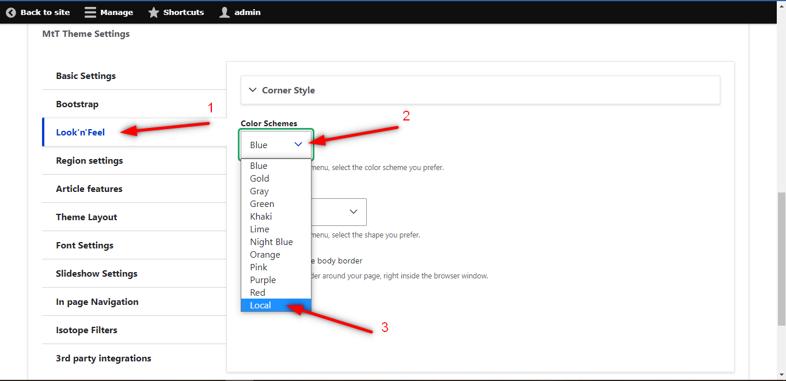
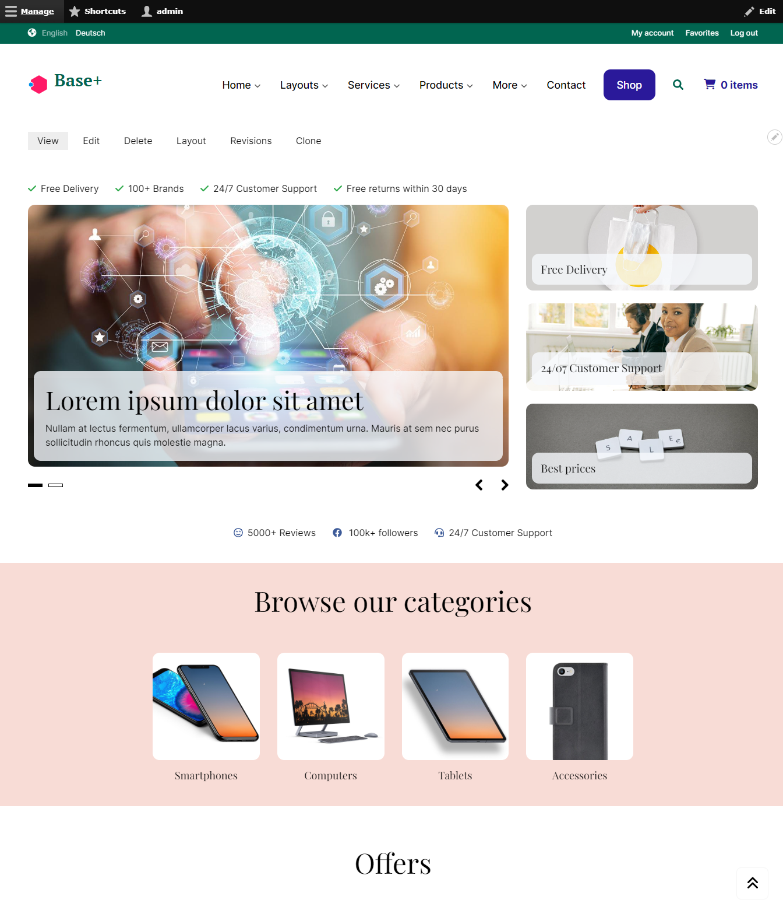
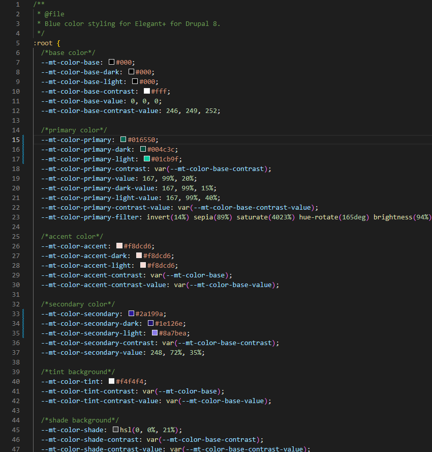
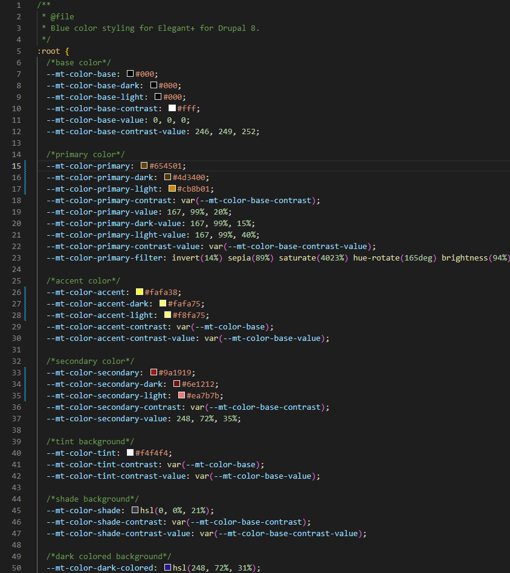
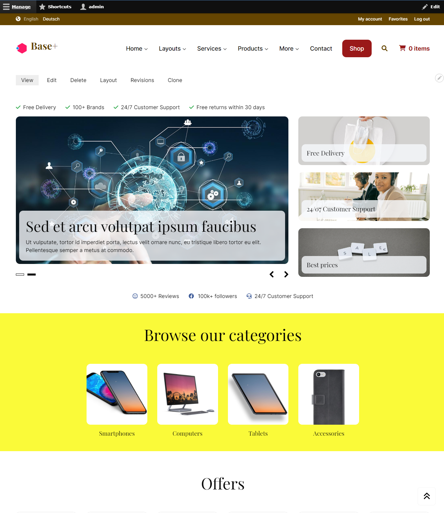

# Customize the color scheme

You can make changes to the colors of the website to make it unique and more personalized.

## Select the Local color profile

1. Visit the **Theme Setting > Look'n'feel**.
2. Select the **Local** Color Scheme.

This will activate the file `css/theme/color-local.css`.

## Adjust the colors

In the file `css/theme/color-local.css` you can find some basic sections of your website:
- Base color
- Primary color
- Accent color
- Secondary color
- Tint background
- Shade background
- Dark colored background
- Colored background
- Bright background
- Dark background
- Pattern background
- Default background
- Success
- Danger
- Warnings
- Forms

The colors of these sections can be customized by changing their hex values. For example, with the Elegant+ theme, the website by default looks like this:

And the file `css/theme/color-local.css` looks like this:

Now we will change the following sections:
- primary color: from green-tiel to brown
- accent color: from pink to yellow
- secondary color: from blue to red

After the changes, the file `css/theme/color-local.css` looks like this:

And the website looks like this:

