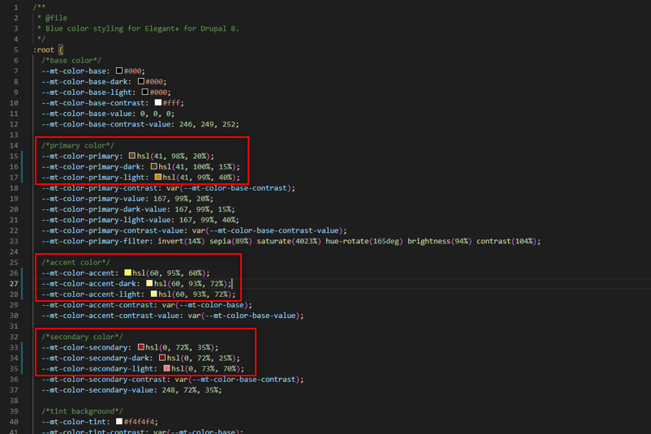

# Customize the color scheme

In the theme settings you can find the option **Local** at **MtT Theme Settings > Look'n'Feel > Color Schemes**:

With this choice, Drupal will use the file `css/theme/color-local.css` for the colors of the website, so you can make any color changes you want in it. For example, you can set a brown-orange for the **primary color**, a yellow for **accent color** and a red for **secondary color** like shown below:

The results:

