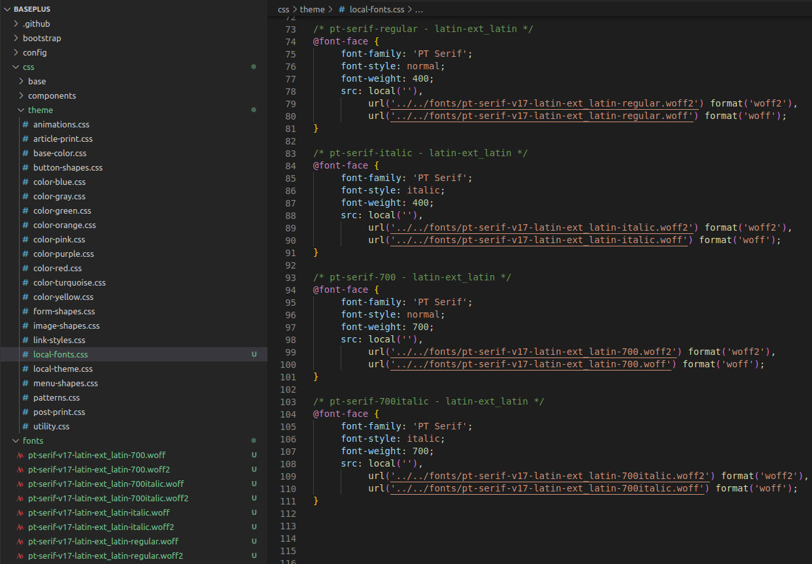
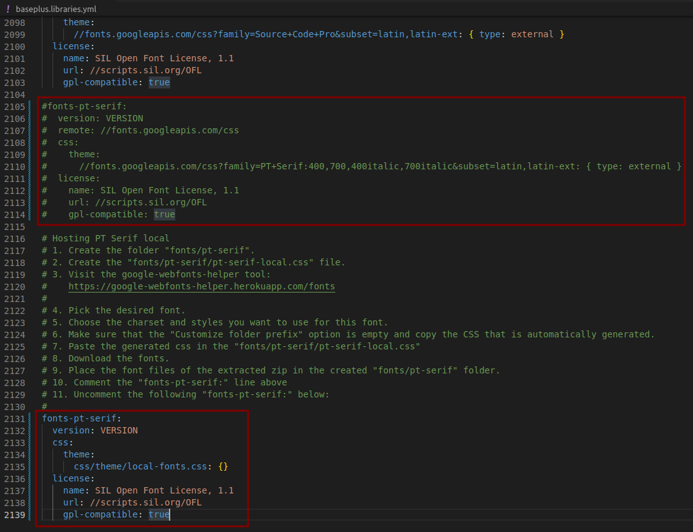
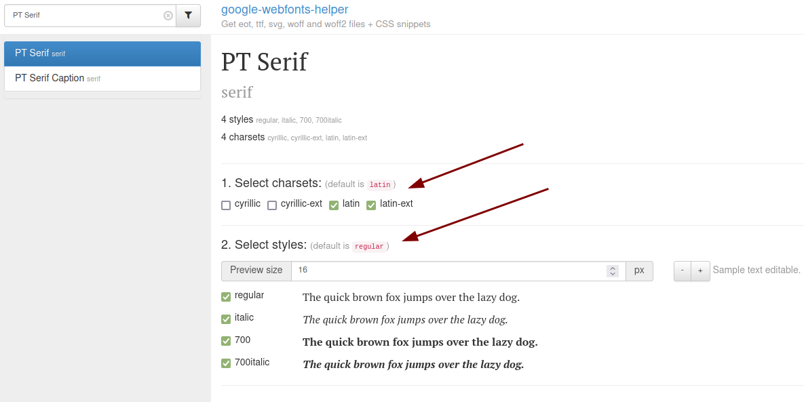
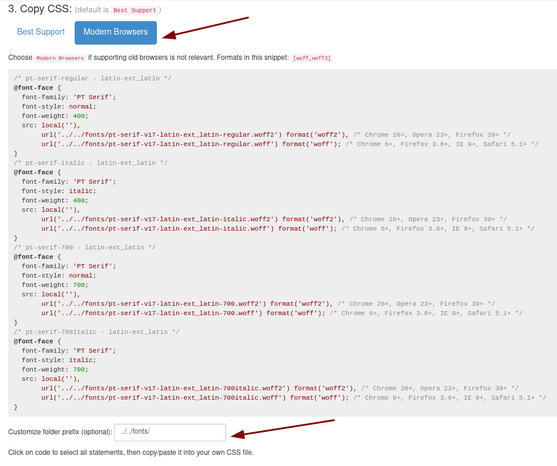
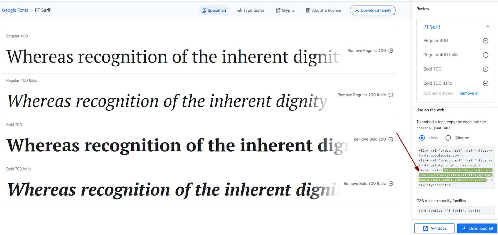
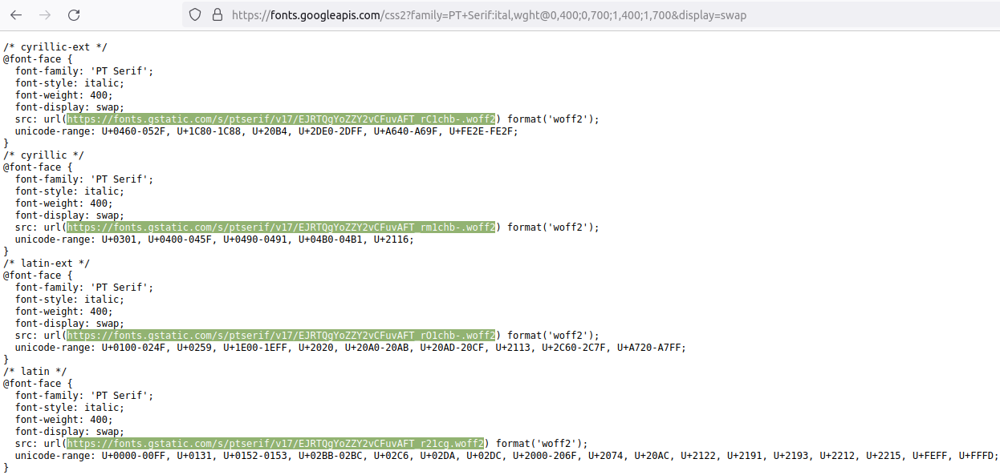

# How to host Google fonts locally

The guide provides step-by-step instructions for hosting Google fonts on your own web server. The steps below refer to the Base+ theme and the PT Serif font, as an example, but they can be applied to any other font loaded in our theme distributions.

1. Create the folder `themes/custom/baseplus/fonts`.
2. Create the `themes/custom/baseplus/css/theme/local-fonts.css` file.
3. Download the font. There are two different ways on how to do that in the chapters below([1](#download-the-google-font-using-the-webfonts-helper), [2](#download-fonts-directly-from-googles-servers)).
4. Place the font files of the extracted zip in the created `themes/custom/baseplus/fonts` folder.
The file structure should look as in the following screen capture:

5. Navigate to the `themes/custom/baseplus/baseplus.libraries.yml` file and comment the `fonts-pt-serif:` line. Then, uncomment the following `fonts-pt-serif:` as in the screen capture below:

## Download the Google font using the webfonts-helper

1. Visit the google-webfonts-helper tool:
https://google-webfonts-helper.herokuapp.com/fonts
2. Pick the desired font.
3. Choose the charset and the styles you want to use for this font.

4. Make sure to choose the **Modern Browser** option and in the  **Customize folder prefix** option set the value to `../../fonts/` and copy the CSS that is automatically generated.

5. Paste the generated css in the `themes/custom/baseplus/fonts/pt-serif/pt-serif-local.css`. In our case we used only the woff2 format.
6. Download the fonts.
7. Place the font files of the extracted zip file in the newly created `themes/custom/baseplus/fonts` folder.  

## Download fonts directly from Google’s servers

This is an alternative to the above download method.
1. Visit Google Fonts, pick **PT Serif** as the font family, and choose the font weights.
https://fonts.google.com/
2. Copy the highlighted link tag with query parameters and open it in a new tab.

3. Each `@font-face` rule, specifies a src to download those font files. Open each URL and download the font.

