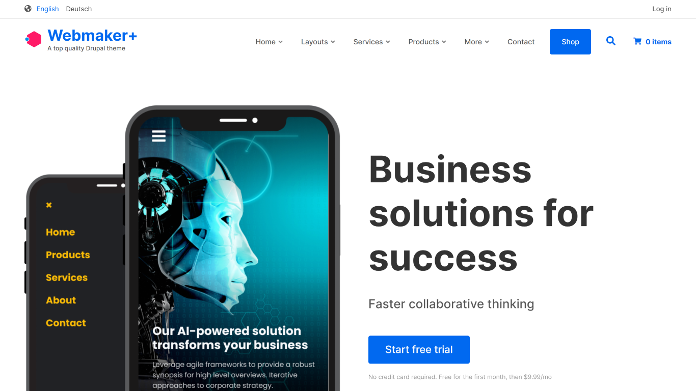
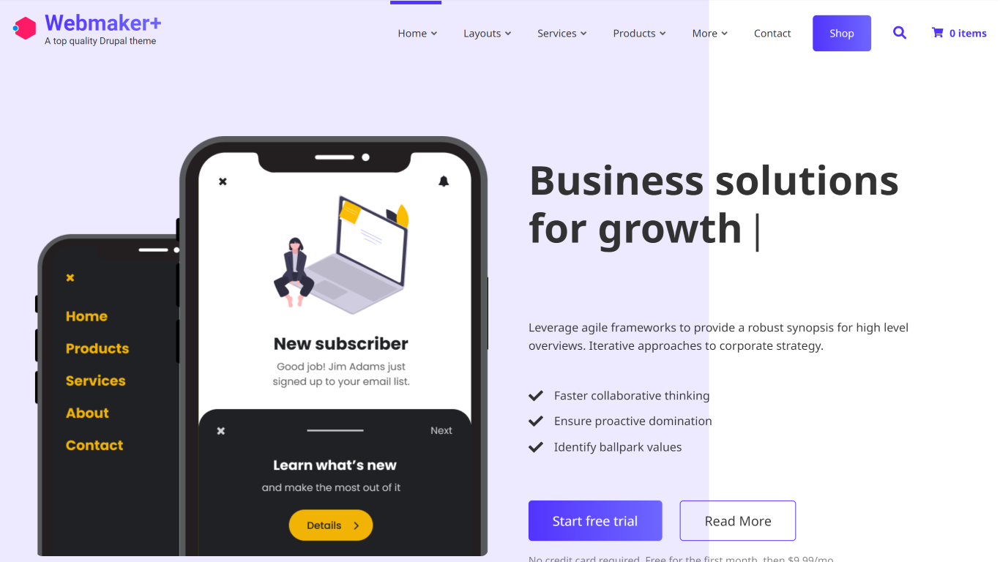
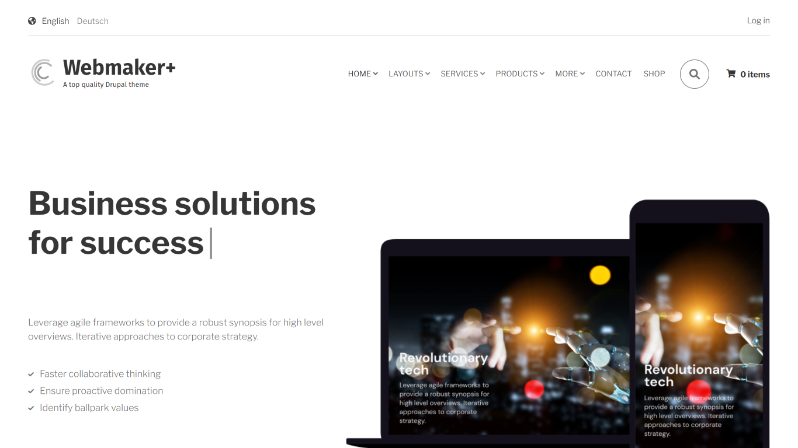
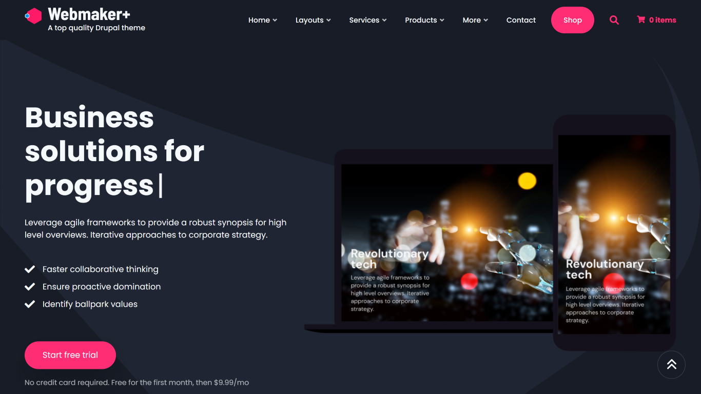
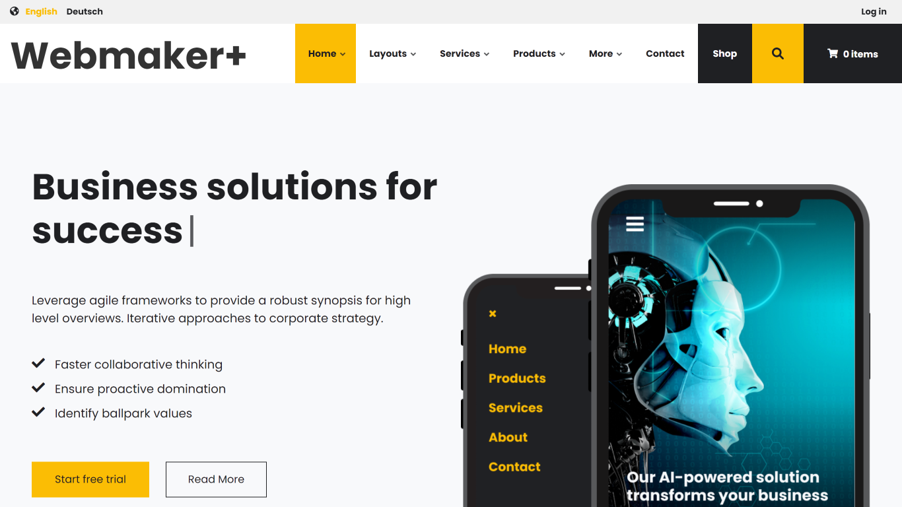
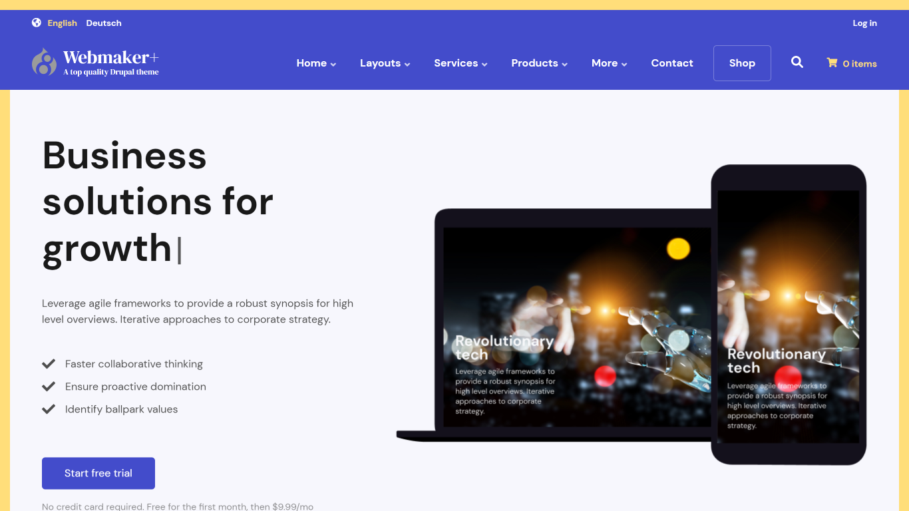
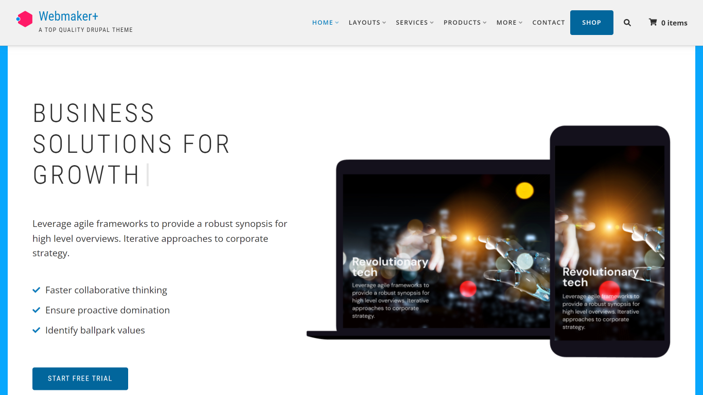
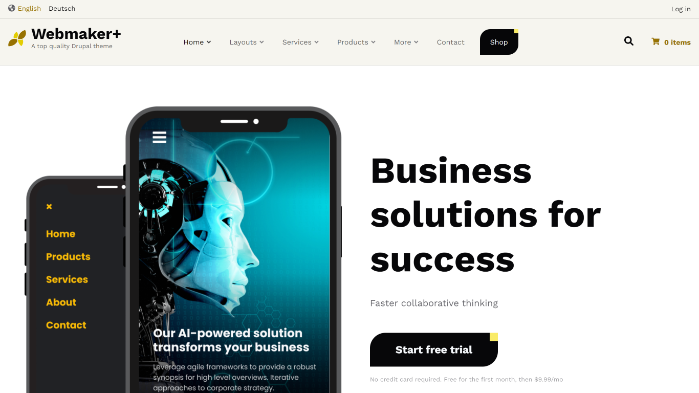
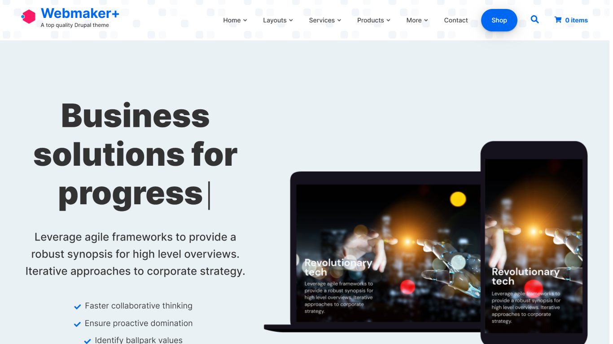

# Themes

Webmaker+ comes with several themes that are interchangeable:

## Base+

A Drupal 9 theme distribution built on a deliberately barebones style guide. Sub-theme it and create your next superb site in no time. Tailored content types, cherry-picked modules, Commerce integration, and 200+ theme settings open unlimited possibilities for you to go online with products, services, client stories, and articles. One more of our interchangeable distributions.

<a className="button button--secondary button--lg" href="https://base.webmaker.plus/">
Try it out! </a>

## Clean+

A Drupal 9 theme distribution with a clean, modern design and a great set of features, custom modules, and 200+ theme settings for presenting your products, services, client stories, and articles. Another one of our interchangeable distributions.

<a className="button button--secondary button--lg" href="https://clean.webmaker.plus/">
Try it out! </a>

## Corporate+

The ultimate, mobile-friendly Drupal theme distribution designed to spotlight your business. The most successful theme we've ever shipped.

<a className="button button--secondary button--lg" href="https://corporate.webmaker.plus/">
Try it out! </a>

## Dark+

A Drupal 9 theme distribution with an impressive, dark design and a great set of features, custom modules and 200+ theme settings for presenting your products, services, client stories and articles.

<a className="button button--secondary button--lg" href="https://dark.webmaker.plus/">
Try it out! </a>

## Flashy+

A Drupal 8/9 theme distribution with an impressive design and a great set of features, custom modules and 200+ theme settings for presenting products, services, client stories and articles.

<a className="button button--secondary button--lg" href="https://flashy.webmaker.plus/">
Try it out! </a>

## Groovy+

A Drupal 9 theme distribution with a colorful design and a great set of features, custom modules and 200+ theme settings for presenting your products, services, client stories and articles. Another one of our interchangeable distributions.

<a className="button button--secondary button--lg" href="https://groovy.webmaker.plus/">
Try it out! </a>

## Showcase+

A state-of-the-art Drupal 9 theme distribution for creatives, trendsetters, design and development studios. With clean, minimal design and a ton of theme settings.

<a className="button button--secondary button--lg" href="https://showcase.webmaker.plus/">
Try it out! </a>

## Sublime+

A Drupal 9 theme distribution with a vintage design and a great set of features, custom modules and 200+ theme settings for presenting your products, services, client stories and articles.

<a className="button button--secondary button--lg" href="https://sublime.webmaker.plus/">
Try it out! </a>

## Team+

A Drupal 9 theme distribution with a futuristic design and a great set of features, custom modules, and 200+ theme settings for presenting your products, services, client stories, and articles. Another one of our interchangeable distributions.

<a className="button button--secondary button--lg" href="https://team.webmaker.plus/">
Try it out! </a>
